# Corte 2 — Nexo

Archivo de trabajo en Figma: [Nexo](https://www.figma.com/design/05HeitlDhNb8rproSvnQhR/Nexo)

## 01 · Flujogramas de usuario

Tres flujos: onboarding y registro de gastos, copiloto IA financiera, y foro de la comunidad. Incluyen los caminos felices y los no felices (en rojo).

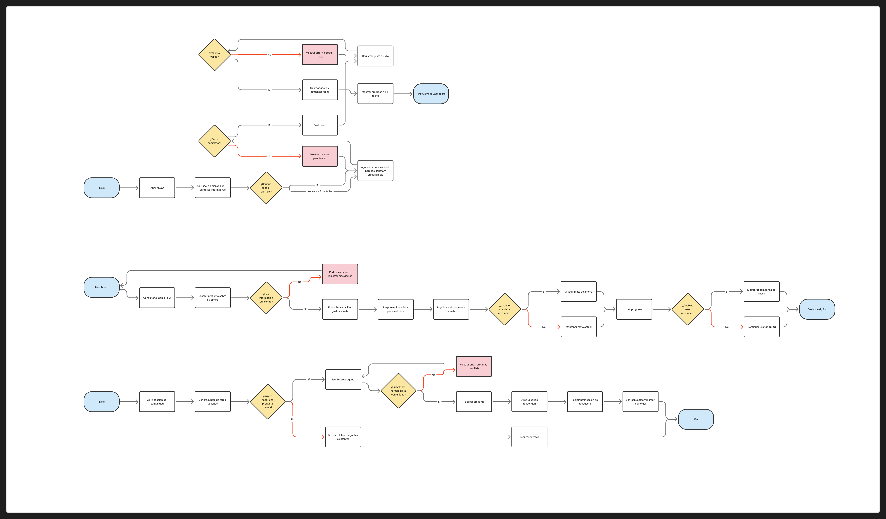

## 02 · Pantallas en baja fidelidad

[Vista general de todas las pantallas](pantallas-baja/00-vista-general.png) · [Mapa de conexiones entre flujos](pantallas-baja/mapa-de-conexiones.png)

### Flujo 1 · Onboarding y registro de datos

Del carrusel de bienvenida al Dashboard, más el registro diario de gastos y la racha.

| 1. Carrusel | 2. Situación inicial | 2b. Campos pendientes | 3. Dashboard |
|---|---|---|---|
| 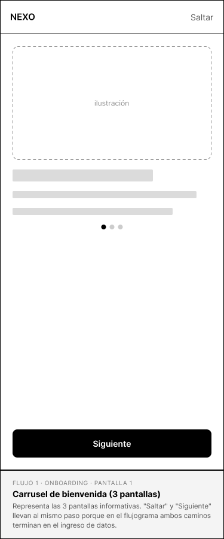 | 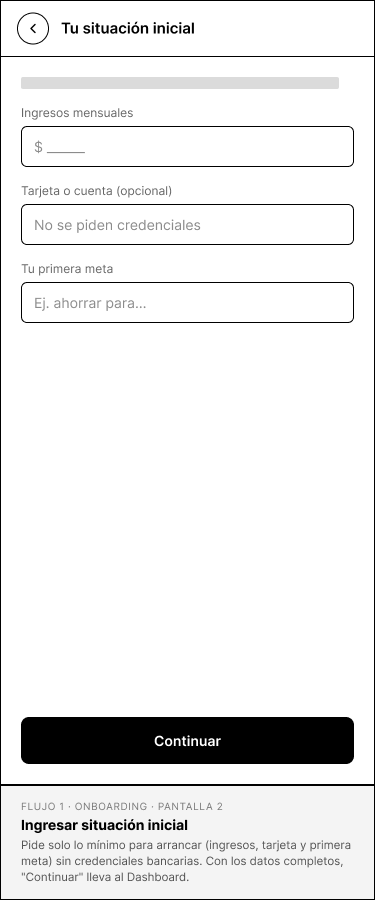 | 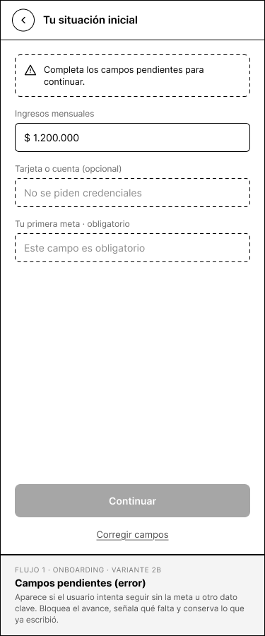 | 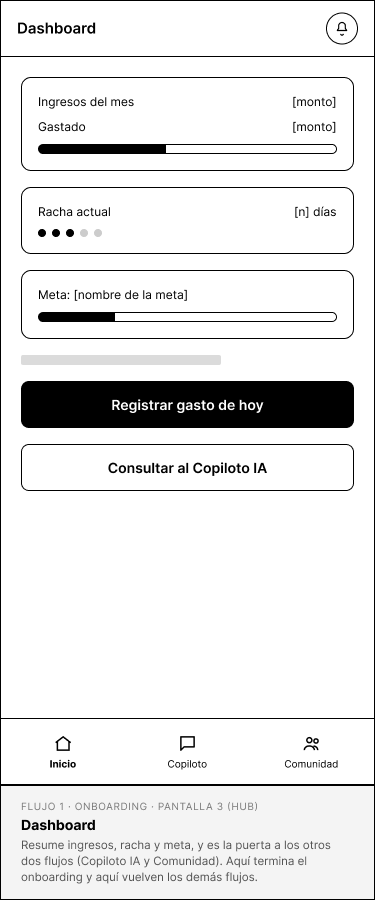 |

| 4. Registrar gasto | 4b. Error de registro | 5. Gasto guardado + racha |
|---|---|---|
| 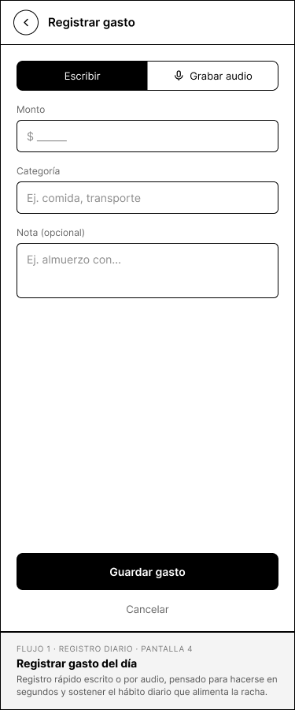 | 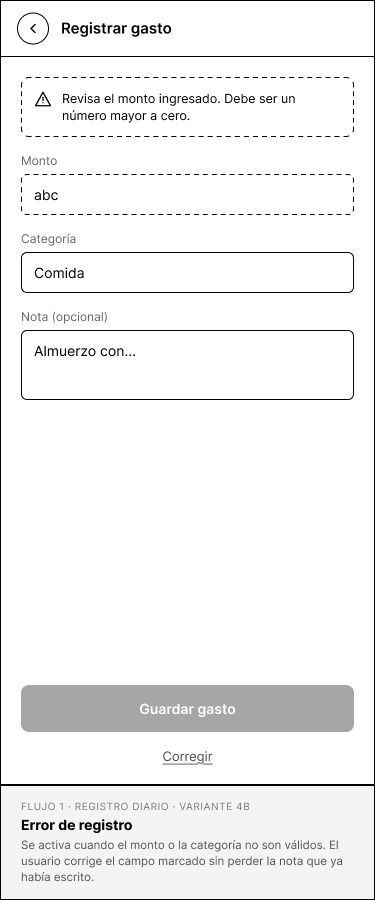 | 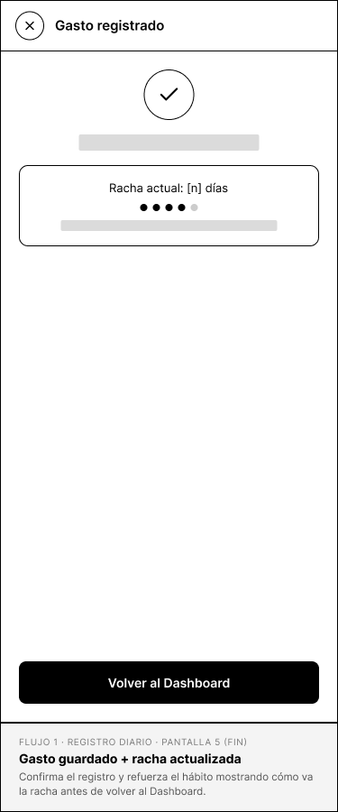 |

### Flujo 2 · Copiloto IA financiera

Pregunta sobre su dinero, respuesta personalizada, ajuste de meta y recompensa de racha.

| 1. Chat con el Copiloto | 1b. Información insuficiente | 2. Respuesta + recomendación |
|---|---|---|
| 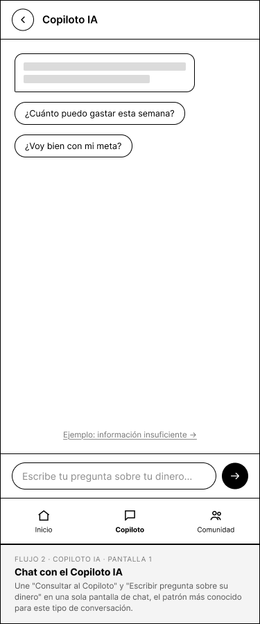 | 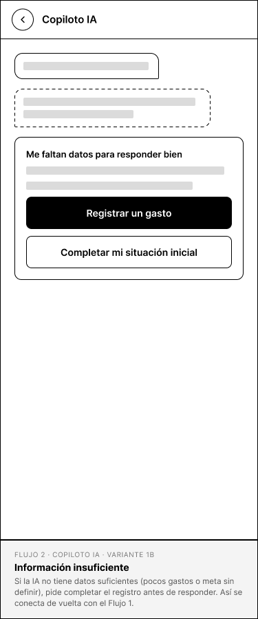 | 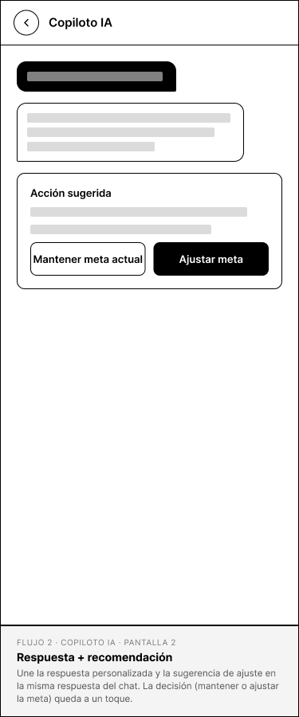 |

| 3. Meta ajustada o mantenida | 4. Progreso + recompensa |
|---|---|
| 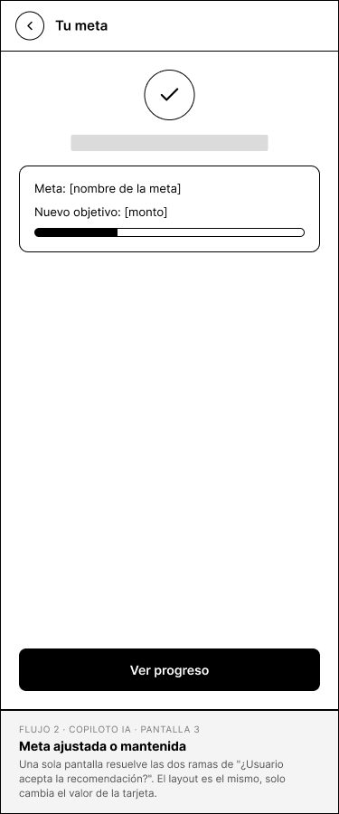 | 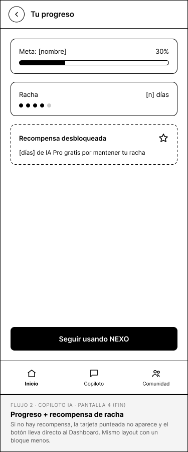 |

### Flujo 3 · Foro de la comunidad

Explorar preguntas, publicar una nueva (con validación de normas) y recibir respuestas.

| 1. Feed de preguntas | 2. Detalle de pregunta | 3. Escribir pregunta |
|---|---|---|
| 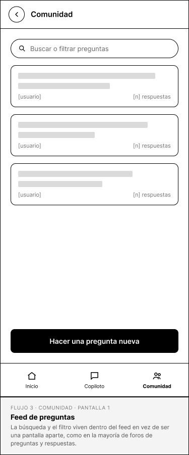 | 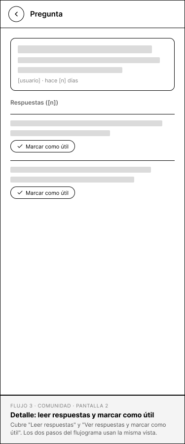 | 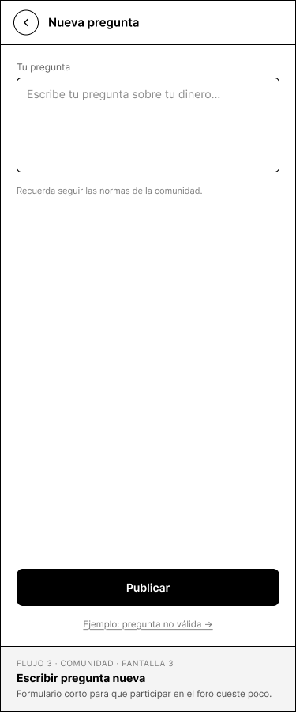 |

| 3b. Pregunta no válida | 4. Pregunta publicada |
|---|---|
| 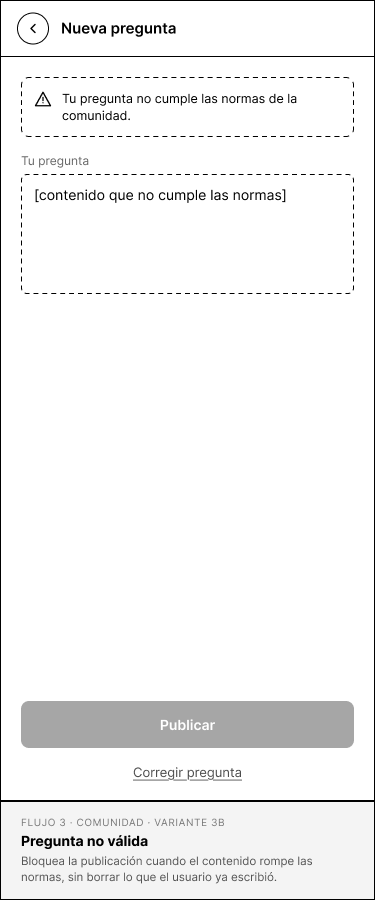 | 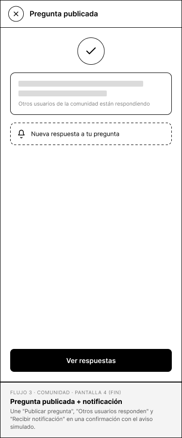 |

## 03 · Lluvia de ideas · Variaciones de estructura

Tres variaciones (A, B, C) para cinco pantallas clave: onboarding, dashboard, registro de gasto, copiloto y foro.

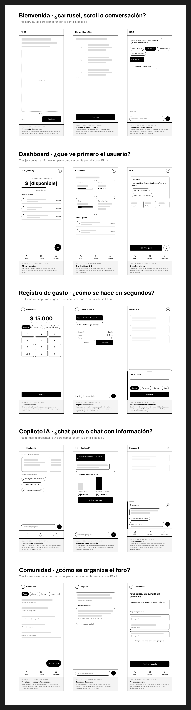

## 04 · Referentes externos

Bancolombia (centro de ayuda) como referente para el foro; Copilot Money y Nequi para el dashboard, el registro de gastos y el tono.

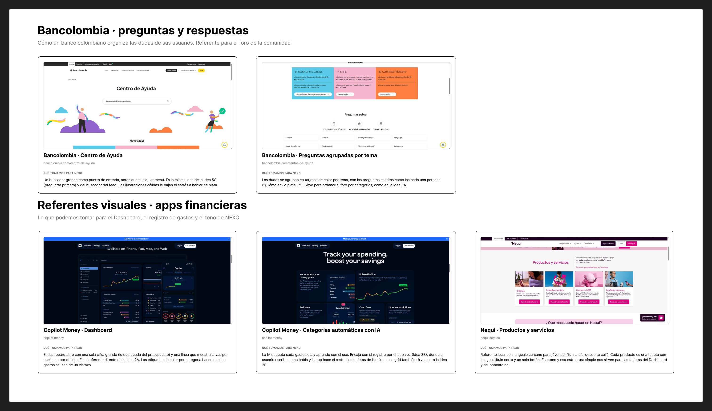

## Pendiente

- `ui-kit/` — UI kit
- `pantallas-alta/` — pantallas en alta fidelidad
- `presentacion-proceso/` — presentación del proceso
